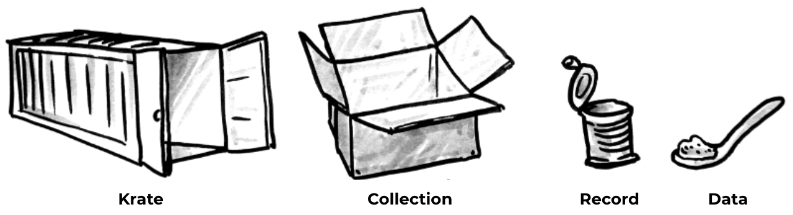

# Overview

Krates, in its essence is a JSON storage service where clients can store, modify and retrieve data.

In order to establish a structure for the API and storage hierarchy, krates introduces some basic concepts.

| Object     | Description                                                                                           |
| ---------- | ----------------------------------------------------------------------------------------------------- |
| Krate      | A krate can be seen as a **namespace**: collection names won’t collide if stored in different krates. |
| Collection | A collection of records.                                                                              |
| Record     | The actual stored data.                                                                               |

> Each kind of object manipulated by Krates have a unique identifier assigned to them.

[!ref icon="archive"](../concepts/krate.md)
[!ref icon="shield-lock"](../concepts/protected-krate.md)
[!ref icon="stack"](../concepts/collection.md)
[!ref icon="note"](../concepts/record.md)
